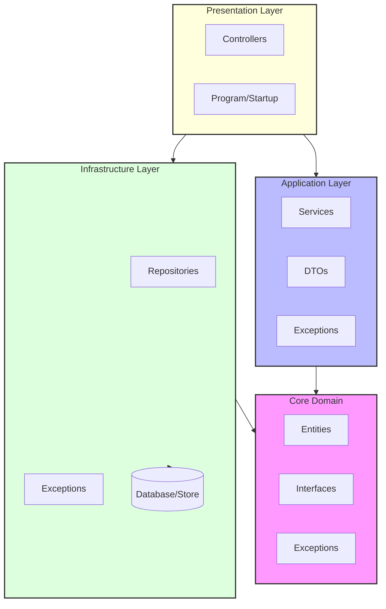

# Architecture Diagram

This diagram visualizes the Clean/Onion Architecture of the AdvancedDevSample project.

```mermaid
graph TD
    subgraph Core [Core Domain]
        E[Entities]
        I[Interfaces]
        Ex[Exceptions]
    end

    subgraph App [Application Layer]
        S[Services]
        D[DTOs]
        AppEx[Exceptions]
    end

    subgraph Infra [Infrastructure Layer]
        R[Repositories]
        InfraEx[Exceptions]
        DB[(Database/Store)]
    end

    subgraph API [Presentation Layer]
        C[Controllers]
        P[Program/Startup]
    end

    API --> App
    API --> Infra
    App --> Core
    Infra --> Core
    Infra --> DB
    
    style Core fill:#f9f,stroke:#333,stroke-width:2px
    style App fill:#bbf,stroke:#333,stroke-width:2px
    style Infra fill:#dfd,stroke:#333,stroke-width:2px
    style API fill:#ffd,stroke:#333,stroke-width:2px
```
