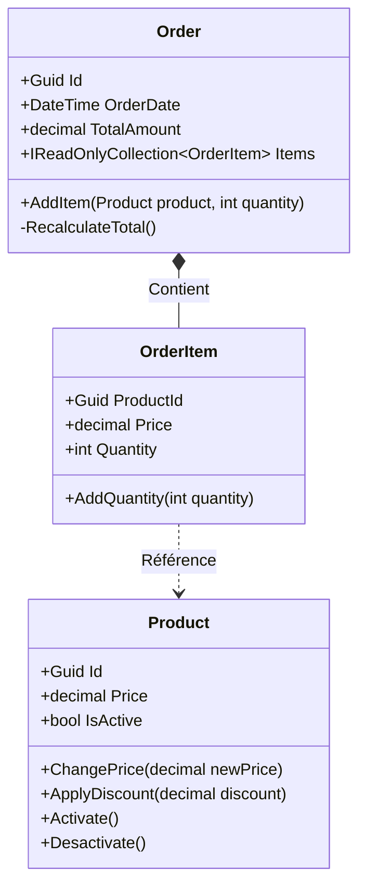

# Class Diagram

This diagram shows the domain entities and their relationships.

```mermaid
classDiagram
    class Product {
        +Guid Id
        +decimal Price
        +bool IsActive
        +ChangePrice(decimal newPrice)
        +ApplyDiscount(decimal discount)
        +Activate()
        +Desactivate()
    }

    class Order {
        +Guid Id
        +DateTime OrderDate
        +decimal TotalAmount
        +IReadOnlyCollection~OrderItem~ Items
        +AddItem(Product product, int quantity)
        -RecalculateTotal()
    }

    class OrderItem {
        +Guid ProductId
        +decimal Price
        +int Quantity
        +AddQuantity(int quantity)
    }

    Order *-- OrderItem : Contient
    OrderItem ..> Product : Référence
```
