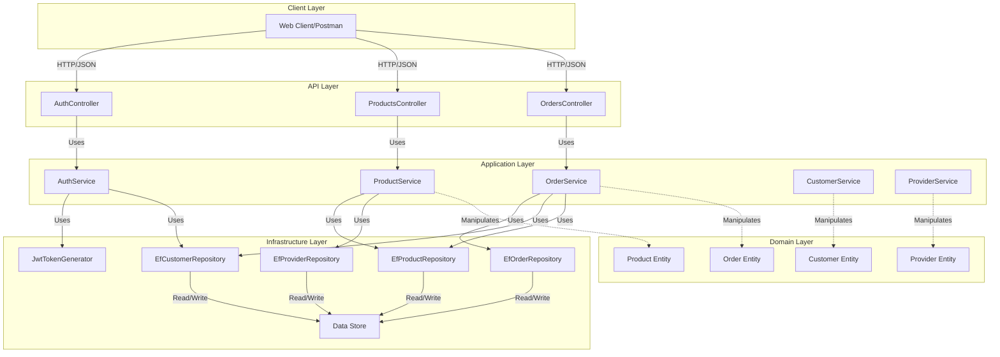

# Component Diagram

This diagram shows the main components of the system and their interactions.

```mermaid
graph TD
    subgraph ClientLayer [Client Layer]
        Client[Web Client/Postman]
    end

    subgraph APILayer [API Layer]
        AC[AuthController]
        PC[ProductsController]
        OC[OrdersController]
    end

    subgraph ApplicationLayer [Application Layer]
        AS[AuthService]
        PS[ProductService]
        OS[OrderService]
        CS[CustomerService]
        PrS[ProviderService]
    end

    subgraph DomainLayer [Domain Layer]
        PE[Product Entity]
        OE[Order Entity]
        CE[Customer Entity]
        PrE[Provider Entity]
    end

    subgraph InfrastructureLayer [Infrastructure Layer]
        JWT[JwtTokenGenerator]
        EPR[EfProductRepository]
        EOR[EfOrderRepository]
        ECR[EfCustomerRepository]
        EPrR[EfProviderRepository]
        DS[Data Store]
    end

    Client -->|HTTP/JSON| AC
    Client -->|HTTP/JSON| PC
    Client -->|HTTP/JSON| OC

    AC -->|Uses| AS
    PC -->|Uses| PS
    OC -->|Uses| OS

    AS -->|Uses| JWT
    AS -->|Uses| ECR
    PS -->|Uses| EPR
    PS -->|Uses| EPrR
    OS -->|Uses| EOR
    OS -->|Uses| ECR
    OS -->|Uses| EPR

    EPR -->|Read/Write| DS
    EOR -->|Read/Write| DS
    ECR -->|Read/Write| DS
    EPrR -->|Read/Write| DS

    PS -.->|Manipulates| PE
    OS -.->|Manipulates| OE
    CS -.->|Manipulates| CE
    PrS -.->|Manipulates| PrE
```
