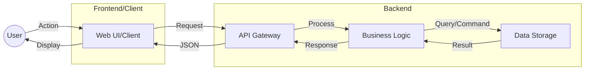

# Flow Diagram

This diagram shows the high-level flow of data through the improved system.

```mermaid
graph LR
    User((User))
    
    subgraph Frontend/Client
        UI[Web UI/Client]
    end

    subgraph Backend
        API[API Gateway]
        Business[Business Logic]
        Data[Data Storage]
    end

    User -->|Action| UI
    UI -->|Request| API
    
    API -->|Process| Business
    Business -->|Query/Command| Data
    
    Data -->|Result| Business
    Business -->|Response| API
    API -->|JSON| UI
    UI -->|Display| User
```
