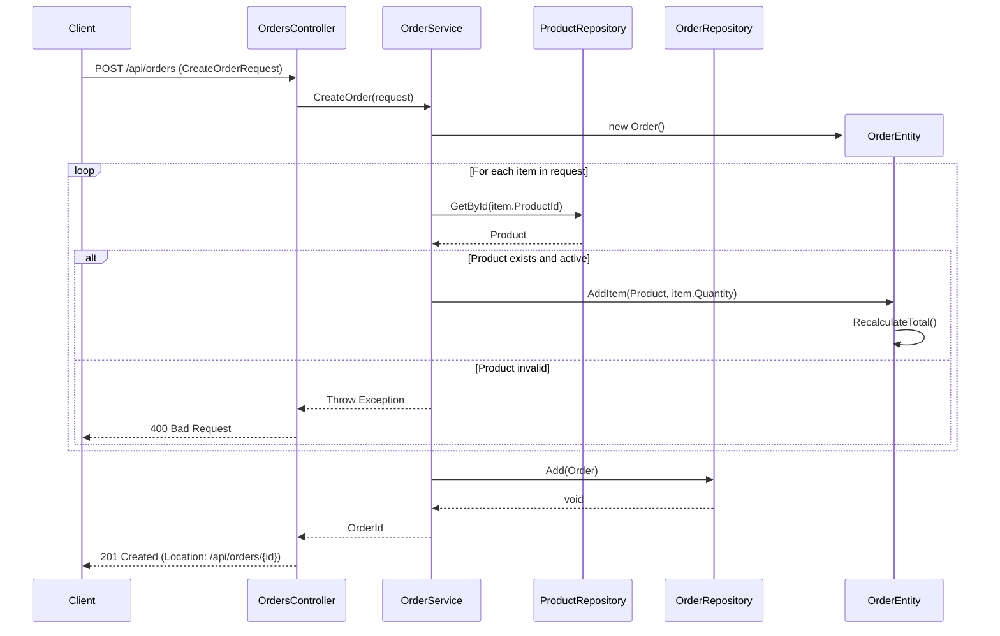

# Sequence Diagram

This diagram illustrates the sequence of operations for creating a new Order.

```mermaid
sequenceDiagram
    participant Client
    participant API as OrdersController
    participant Service as OrderService
    participant ProdRepo as ProductRepository
    participant OrderRepo as OrderRepository

    Client->>API: POST /api/orders (CreateOrderRequest)
    API->>Service: CreateOrder(request)
    
    create participant Order as OrderEntity
    Service->>Order: new Order()

    loop For each item in request
        Service->>ProdRepo: GetById(item.ProductId)
        ProdRepo-->>Service: Product
        
        alt Product exists and active
            Service->>Order: AddItem(Product, item.Quantity)
            Order->>Order: RecalculateTotal()
        else Product invalid
            Service-->>API: Throw Exception
            API-->>Client: 400 Bad Request
        end
    end

    Service->>OrderRepo: Add(Order)
    OrderRepo-->>Service: void
    
    Service-->>API: OrderId
    API-->>Client: 201 Created (Location: /api/orders/{id})
```
